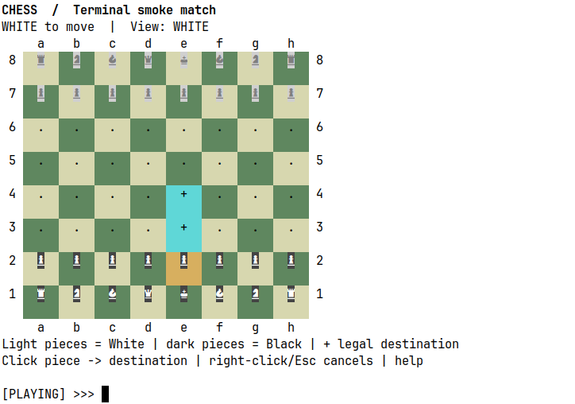
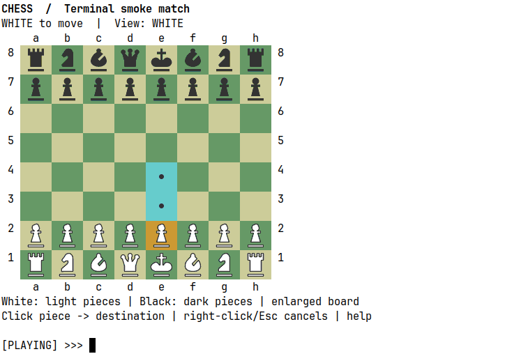
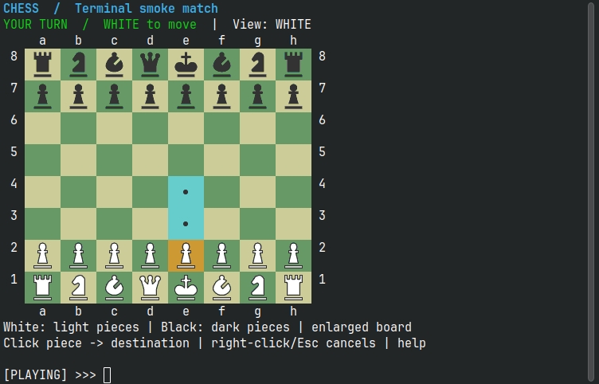
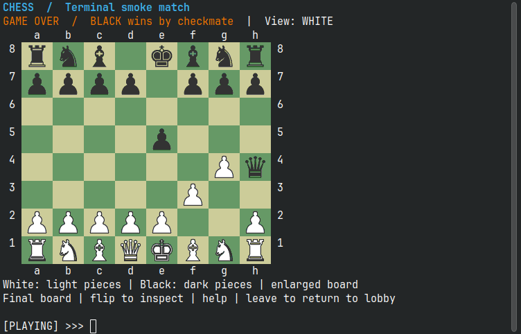

# Chess CLI goals and before and after comparison

[PR #2 — Add mouse controls and readable adaptive chess CLI](https://github.com/jf300exc/chess/pull/2) builds on the CLI preserved by PR #1. The goal is a clearer terminal game with optional mouse control, direct commands, and a board whose pieces are readable at a normal terminal font size. The GUI, server protocol, and chess rules are not being replaced.

This document records the goals and delivered implementation. The earlier revision of PR #2 already added mouse input and commands, but its visual result was not acceptable: real terminal screenshots showed undersized, top-heavy glyphs with separate rectangular backgrounds. Grid-coordinate tests alone did not establish visual quality. The corrected renderer has now been checked in actual xterm and Konsole windows, using the same normal 11-point text size.

## Before and after

| Area | Before this PR | Result delivered by this PR |
| --- | --- | --- |
| Moving pieces | Enter move commands and answer coordinate prompts. | Keep text commands and add click-to-select, highlighted legal destinations, and click-to-move when terminal mouse reporting is available. |
| Unsupported terminals | The original interactive renderer assumes terminal control sequences. | Noninteractive input and limited terminals use plain line input. Mouse and graphics are detected separately; neither is required to play. |
| Piece appearance | Small font-dependent chess glyphs can be hard to read. The first PR #2 attempt replaced them with two-letter labels, then reverted to small symbols with badge backgrounds. | Preserve recognizable chess-piece silhouettes. In a terminal that positively advertises graphics and usable pixel geometry, scale only the board pieces inside their squares. Do not enlarge the entire terminal font. |
| Centering and backgrounds | The revised glyphs sit toward the top of two-row squares, and contrast patches interrupt square backgrounds. | Center the visible piece outline horizontally and vertically by its pixel bounds. Draw directly on the square background, without a rectangular piece badge. Keep square coloring and selected/legal-square highlights. |
| Font choices | Symbol coverage and glyph sizes depend on the terminal font. | Standard chess symbols remain available. Nerd Font icons are optional; missing icon fonts fall back to standard chess shapes. Explicit ASCII output is available for restricted fonts. |
| Readability without graphics | A symbol occupies one terminal character, regardless of extra surrounding padding. | Use a compact, badge-free symbol board as the fallback. Be explicit that ordinary text terminals cannot independently enlarge one character using standard ANSI coloring and padding. |
| Commands | Many actions require repeated prompts and exact command spelling. | Accept case-insensitive commands, extra whitespace, direct coordinate moves, inline promotion, `status`, `moves`, `highlight`, and `flip`. |
| Roles and orientation | Display orientation and the player's assigned team can be confused. | Flipping affects only the view. Observers may inspect legal moves but cannot submit them. Only the assigned player can move on that player's turn. |
| Screen updates | The earlier graphical revision clears and repaints the full board when selection or log state changes. Its first incremental implementation exposes black padding below some patches. | Fixed-position text differences leave unchanged rows in place. Graphical updates compare square pixels and emit local patches with complete six-pixel bands, preserving adjacent pixels and staying inside the board. Typing, notifications, and duplicate unchanged game snapshots do not repaint the board. |
| Turn and waiting cues | Turn/check messages are plain, with no personal turn cue. | Green `YOUR TURN`, red check/errors, cyan waiting/notifications, and yellow warnings. A small waiting spinner updates twice per second without touching the board. Observers do not get personal turn cues; turn-start labels remain steady. |
| Game completion | A generic game-over message provides little detail. | Show the winning team on checkmate, a draw on stalemate, and the server's resignation message when known. Keep the final board visible with inspection and return-to-lobby hints. Do not infer a resignation winner from whose turn it was. |
| Motion and color preferences | No explicit motion or gameplay-color override. | Add `--no-animation` and `--no-color`; honor nonempty `NO_COLOR`. Plain text stays still and uncolored. Uncolored Nerd Font text uses distinguishable Unicode team shapes. |
| Input ownership | Multiple readers and background rendering can compete over standard input. | One console owns input across the lobby and match. Mouse reports do not become command text, and selection does not discard a partially typed command. |
| Exiting a game | Disconnects, interrupted input, and EOF can leave terminal state inconsistent. | Restore mouse reporting, keyboard modes, and the previous screen on leave, Ctrl-C, EOF, connection failure, and cleanup. |
| Validation | Engine tests alone cannot prove terminal interaction or appearance. | Add focused CLI tests, pseudo-terminal scenarios, graphics protocol tests, and actual terminal screenshots at a normal font size. Verify that the displayed board and mouse hit map agree. |

## Visual acceptance criteria

The renderer's acceptance criteria are recognizable pieces occupying a useful portion of their squares, with no per-piece rectangular background, and visible silhouettes centered in both axes. An 80×24 terminal must keep the board, current state, and input usable at a normal text font size. Legal-move markers, coordinates, and mouse targets must agree with the rendered layout. Pixel-bound tests and the real terminal screenshots below verify these properties for the tested configurations.

Graphics require a positive capability response and valid pixel dimensions. Missing or malformed responses select the symbol fallback, rather than printing image data into an unsupported terminal. Input captured during probing is preserved, but pre-paint mouse events cannot act on a stale hit map. Plain text and `--no-mouse` remain usable. `--no-graphics` provides an explicit symbol-board override. If SIXEL display mode needs to be changed for cursor-anchored drawing, its reported previous setting is restored on exit.

## Visual correction within this PR

These are actual terminal-window screenshots, not reconstructed mockups. The before image is the rejected early PR #2 revision, rather than the original CLI on `main`. Both xterm screenshots use an 80×24 window and JetBrainsMono Nerd Font Mono at 11 points. The surrounding text size is unchanged; only the board shapes become larger.

### Before the renderer correction



### After the renderer correction



The corrected board also works in [Konsole with Nerd Font shapes](assets/cli-after-konsole.png). [Default Unicode chess shapes](assets/cli-default-konsole.png) are enlarged without needing the Nerd Font option. [The compact symbol fallback](assets/cli-fallback-konsole.png) removes badges and uses one row per rank, but cannot independently enlarge terminal text glyphs.

## Incremental updates and game status

The latest revision keeps the enlarged shapes and adds colored experience cues. This actual Konsole screenshot uses the same 11-point text size, with a steady personal turn label:



[A confirmed e2e4 move](assets/cli-incremental-konsole.png) was captured after the initial board had already been displayed, exercising partial square repainting rather than an initial full render. The source square is cleared, the pawn appears on its destination, and the remaining board stays intact. The small waiting spinner is confined to the status line. A screenshot alone cannot demonstrate absence of flicker; the pseudo-terminal checks separately assert that ordinary input emits no full-screen clear and that this move emits two local patches.

Konsole's [SIXEL implementation](https://github.com/KDE/konsole/blob/master/src/Vt102Emulation.cpp) rounds decoded image height to the end of the final six-pixel band, leaving unpainted padding black. A 40-pixel square patch therefore previously produced a two-pixel black strip below it. The corrected patches occupy complete bands and terminal rows, supplying the exact adjacent-board pixels where extra coverage is needed. Bottom patches shift upward to stay within the board; initial rendering can use two overlapping images rather than cover the lower file labels. Automated screenshot checks verify square corners and the bottom boundary after a move, selection, and [bottom-rank selection](assets/cli-bottom-edge-konsole.png).

The game-over screen keeps the final position and identifies the outcome:



No piece animation, sound, flashing square, or flashing turn banner is added. `--no-animation` keeps waiting text completely still. `--no-color` disables gameplay text styles and symbol-square colors, but not the color pixels in enlarged board images; combine it with `--no-graphics` for an uncolored gameplay screen. Full refresh remains appropriate for resize, switching away from the graphic board to help, or explicit `redraw`.

## Verification

- `make build` passes.
- The focused CLI suite has 31 passing tests, including capability parsing, input preservation, pixel centering for all piece types, absence of badges, image size limits, an independent SIXEL pixel round trip, fixed-position text differences, protected image regions, move damage, and outcome/role cues. Boundary coverage checks 12 terminal pixel heights and three layouts for exact neighboring pixels, complete bands, and no out-of-board patches.
- Java 21 verification passes 107 engine tests, those 31 CLI tests, and eight desktop board/lifecycle tests under Xvfb: 146 tests total across the focused runs. The three desktop board tests also pass in headless mode.
- The POSIX pseudo-terminal harness passes 37 scenarios covering text and graphics paths, legal mouse moves, observers, promotion, help, flips, resizes, typed-prefix preservation, malformed pixel replies, cleanup, prior SIXEL mode restoration, and stale pre-paint mouse input. The added scenarios assert no board repaint on typing, notifications, waiting animation, or duplicate snapshots; verify local patches on selection/cancel and confirmed moves; and check quiet motion-disabled waiting, `NO_COLOR`, game-over messages, 40-pixel and odd-height squares, and bottom-rank updates. Every encoded image is checked for complete six-pixel bands. See `scripts/test-cli-terminal.py` for the executable scenarios.
- Actual xterm and Konsole screenshots were inspected at 11 points, including default shapes, Nerd Font shapes, the symbol fallback, and the latest colored status/game-over screens. Partial updates after a move in Konsole and a flip in xterm were also inspected.

Full MySQL integration tests were not rerun for these renderer and experience changes; the previous PR #2 attempt could not connect to the database. The earlier display-access constraint has been resolved for the GUI regression checks by using an isolated Xvfb display. No test database was cleared during this work.

The terminal screenshots can be reproduced after `make build` with the optional QA tools Xvfb, xwininfo, ImageMagick, and the selected emulator:

```sh
python3 scripts/capture-cli-terminal.py --emulator xterm --pieces nerd --output /tmp/chess-xterm.png
python3 scripts/capture-cli-terminal.py --emulator konsole --output /tmp/chess-konsole.png
python3 scripts/capture-cli-terminal.py --emulator konsole --scene checkmate --output /tmp/chess-game-over.png
python3 scripts/capture-cli-terminal.py --emulator konsole --scene updated --output /tmp/chess-after-move.png
python3 scripts/capture-cli-terminal.py --emulator konsole --scene bottom --check-square-edges --output /tmp/chess-bottom-edge.png
```

`--check-square-edges` additionally requires Pillow for screenshot pixel inspection; Pillow is not a client runtime dependency.

## Expected usage

```sh
make cli                            # Detect mouse and terminal graphics support
make cli CLI_ARGS="--no-graphics"    # Symbol board, retaining supported mouse input
make cli CLI_ARGS="--no-mouse"       # Use keyboard commands
make cli CLI_ARGS="--pieces=nerd"    # Optional Nerd Font piece shapes
make cli CLI_ARGS="--no-animation"  # Steady waiting text, no spinner
make cli CLI_ARGS="--no-color --no-graphics"  # Uncolored gameplay screen
make cli CLI_ARGS="--text --pieces=ascii"  # Plain input and ASCII board
```

## Scope and limits

This PR does not add a chess engine opponent, online matchmaking, clocks, saved-game export, or new game rules. Automatic graphics enlargement applies only where the terminal confirms support. Visual validation in an isolated terminal is stronger than a reconstructed image but does not prove compatibility with every terminal, remote session, or multiplexer.
