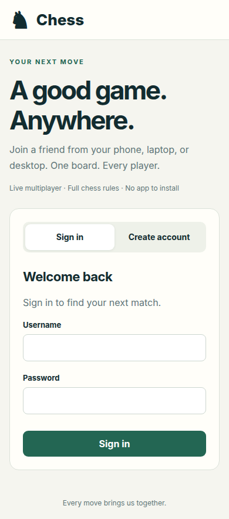
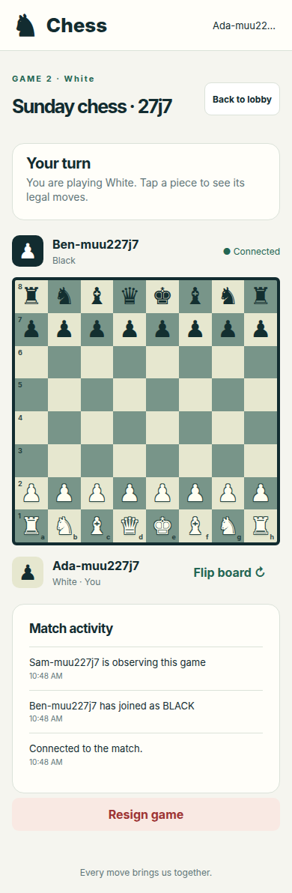
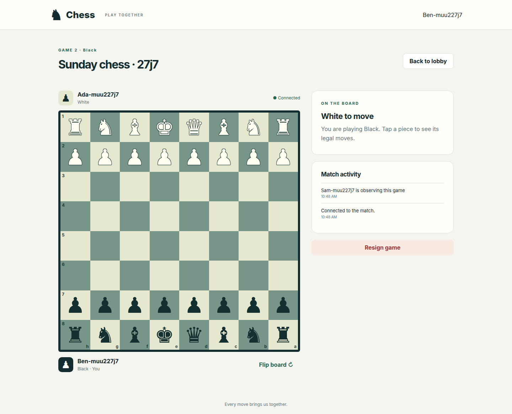
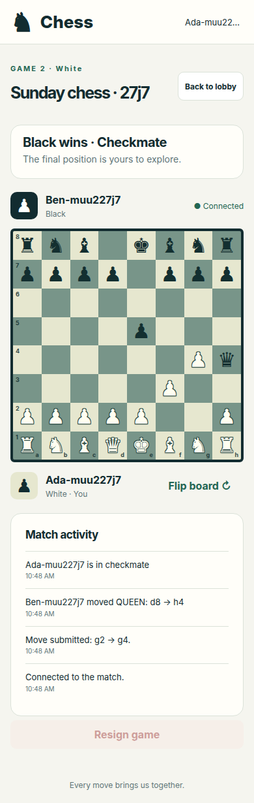

# Browser chess client

This change builds on PR #2 (`feature/advanced-cli`) and adds a third client for the same multiplayer server. A phone can open the server's address, sign in, take a seat, and play against another browser, the CLI, or the desktop client.

## Before and after

| Area | Before | With this change |
| --- | --- | --- |
| Server homepage | HTTP/WebSocket API playground | Playable accounts, lobby, and chess board |
| Phone access | Required a Java client | Browser connects directly to the server that serves the page |
| Board controls | Desktop/terminal controls | Touch, mouse, keyboard, legal destinations, flip, and promotion choices |
| Game state | Native clients interpret the chess board | Java engine supplies legal moves and check/checkmate/stalemate flags |
| Interrupted connection | Native-client lifecycle | Moves pause; browser reconnects and reloads the authoritative position |
| API tools | Homepage | Preserved at `/api/index.html` |

## Screenshots

### Phone sign-in

### Phone gameplay

The phone layout puts the turn status above the board. Player names and match activity update as players join, move, and leave. The same board supports observers without enabling move submission or resignation.

### Desktop gameplay

### Checkmate

## Implementation

After successful startup, the server prints localhost and local-network browser URLs with interface names and the actual listening port. It lists active interfaces, formats IPv6 URLs with brackets, and omits loopback, wildcard, multicast, and IPv6 link-local addresses from the other-device list.

The browser is static HTML, CSS, and JavaScript packaged with the existing server jar. There is no frontend build step or runtime package download. Requests use the existing `/user`, `/session`, `/game`, and `/ws` contracts and the current page's hostname/port. HTTPS selects secure WebSockets automatically.

`LOAD_GAME` adds `legalMoves`, `inCheck`, `checkmate`, and `stalemate` fields. They are computed from a copied Java game so legal-move generation does not alter the live board. Existing message fields and command formats remain intact, and native clients ignore the added fields. Server validation remains authoritative for every move.

The session token and current game ID are stored in per-tab session storage; the password is cleared after sign-in. A board update cancels stale selections or an open promotion dialog. A pending move is not sent again when reconnecting. Leave and resignation ask for confirmation, and usernames/game names are rendered as text.

The existing server sends join, leave, and resignation notifications without a new board snapshot. Browser clients refresh the seat names on join/leave notifications and mark resignation as ended; reconnecting retrieves its persisted game-over state.

## Validation

- `make build` packages the application and browser assets.
- The full 255-test Java suite passed with zero failures, errors, or skips before the startup-address follow-up. Three new address-formatting tests also pass; the startup banner and printed Wi-Fi URL were verified on a running server with a custom port. The complete suite runs against a temporary MySQL instance and an isolated virtual display, including chess rules, HTTP/WebSocket integration, database, CLI, transport, and desktop GUI tests.
- Five new shared tests verify wire coordinates and legal moves, nonmutation of the live board, checkmate, stalemate, resignation, and every promotion choice.
- `make test-web` drives Chrome against the real server at 320px, 390px, and 1440px widths, with touch input on phone views. It checks registration and sign-in, lobby creation, seat assignment, observer restrictions, orientations, flip/cancel, broadcasts, reload/network recovery, checkmate, confirmed resignation, promotion for both colors, castling, en passant, sign-out, text rendering of hostile game names, and horizontal overflow.

Screenshots are from browser emulation, rather than a physical phone. The test harness creates unique users/games and never clears the database; use a disposable server for tests. See the README for phone connection and browser-test setup instructions.
